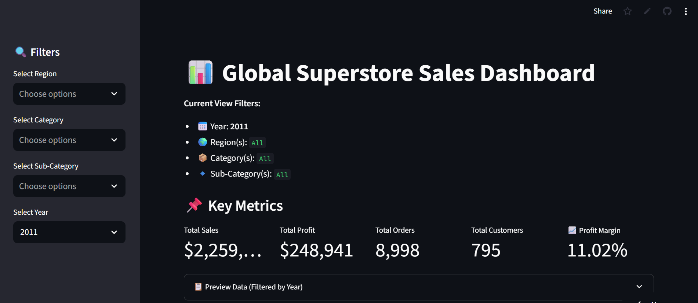
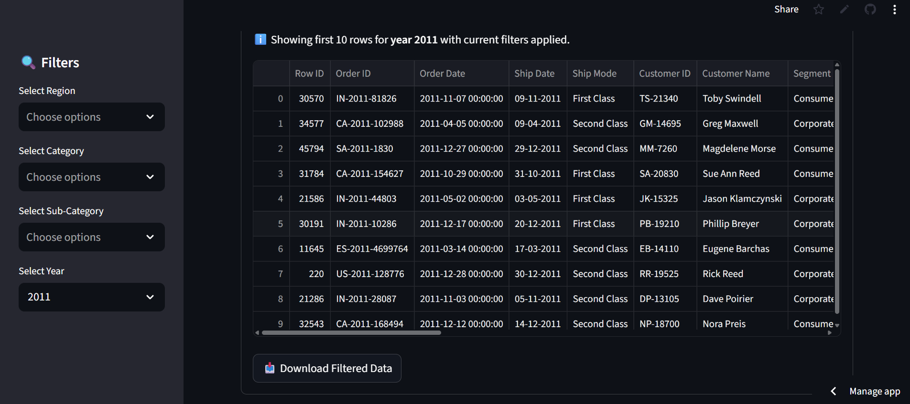
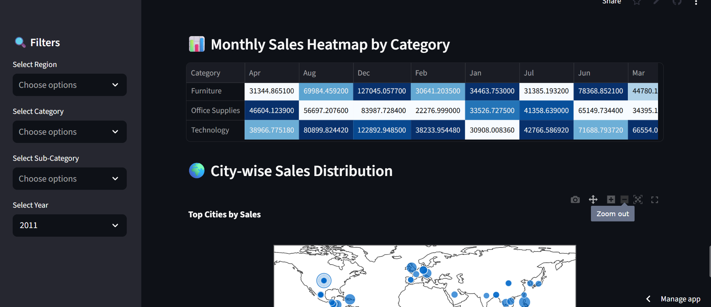
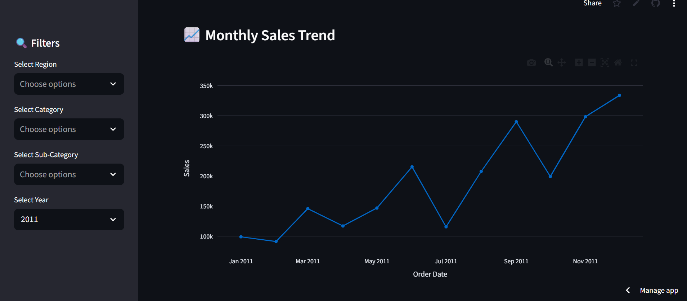
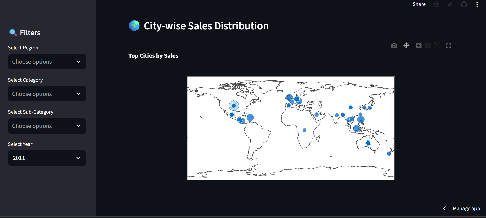
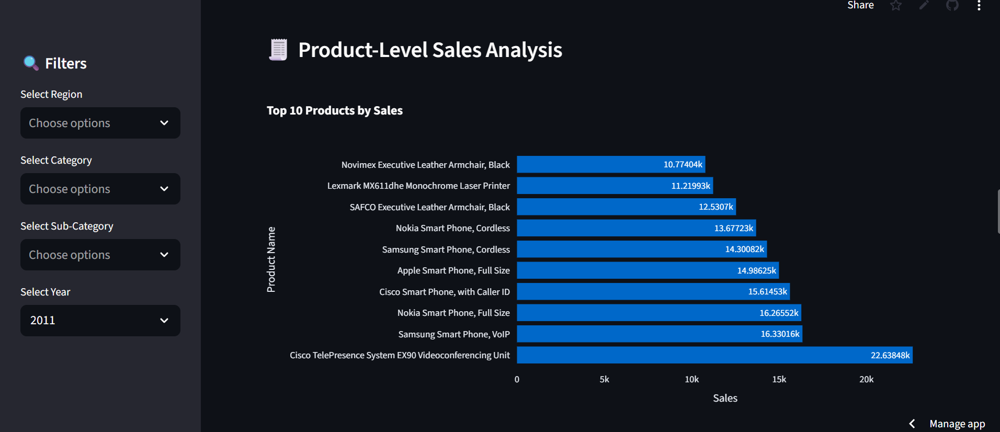
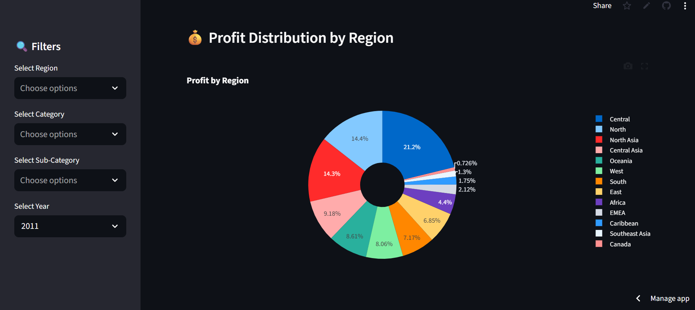
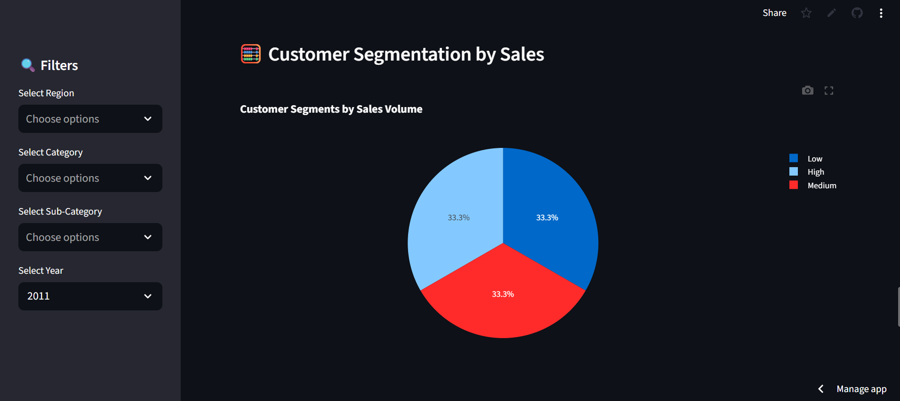
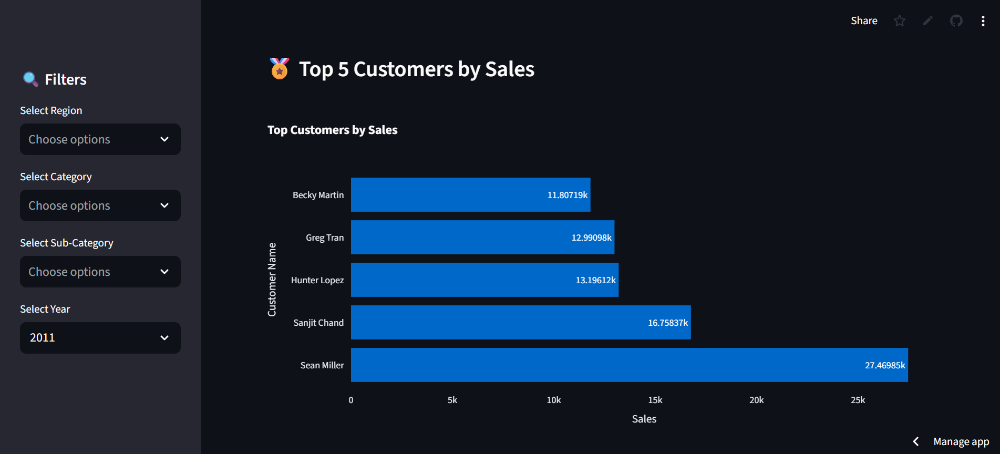

# 📊 Global Superstore Sales Dashboard

[](https://streamlit.io)
[](https://www.python.org/)
[](LICENSE)
[](https://superstore-app-dashboard-gznge95jntfl2yardnu4nc.streamlit.app/)


---

A fully interactive, professional **Streamlit dashboard** built for analyzing the *Global Superstore* dataset. Designed for business intelligence insights across sales, profit, customer behavior, and regional trends.

> 📌 *Ideal for showcasing in portfolios, BI case studies, or analytics interviews.*

---

## 🚀 Live Demo

🌐 [**Click here to view the deployed app**] 
([https://your-streamlit-cloud-link](https://superstore-app-dashboard-gznge95jntfl2yardnu4nc.streamlit.app/))


---

## 🎯 Key Features

✅ **Interactive Filters:**
• Year, Region, Category, Sub-Category

📌 **Dynamic KPIs:**
• Total Sales, Profit, Orders, Unique Customers
• 📈 Profit Margin (%)

📊 **Charts & Visualizations:**

* Sales by Category *(Bar Chart)*
* Profit by Region *(Pie Chart)*
* Monthly Sales Trend *(Line Chart)*
* Product-Level Drill Down *(Top 10 Products)*
* Top Customers by Profit & Sales
* Customer Segmentation by Sales *(Pie Chart)*
* Monthly Sales Heatmap *(by Category)*
* City-Wise Sales Map *(Geo Scatter Plot)*

📋 **Data Preview & Export:**
• Preview filtered dataset
• Download CSV with one click

🖥️ **Responsive & Clean UI:**
• Wide layout, clear color usage, and tooltips

---

## 🧠 Skills Demonstrated

* ✅ Business Intelligence & KPI Dashboards
* ✅ Data Storytelling with Visual Insights
* ✅ Streamlit for Interactive Web Apps
* ✅ Plotly for Rich Data Visualizations
* ✅ Customer Segmentation & Drilldowns
* ✅ Data Cleaning & Preprocessing (Pandas)

---

## 📁 Repository Structure


```

📦 superstore-streamlit-dashboard
├── 📄 app.py                   # Main Streamlit dashboard app
├── 📄 Global_Superstore.csv    # Dataset used for visualizations
├── 📄 LICENSE                  # MIT License file
├── 📄 README.md                # Project documentation
├── 📄 requirements.txt         # Python dependencies
├── 📄 dataset-readme.md        # Description of dataset fields
├── 📁 screenshots/             # App screenshots used in README
└── 📁 notebook/                # Jupyter notebooks 

```


---

## 🛠️ Installation & Setup

### ✅ Requirements

```bash
pip install streamlit pandas plotly
```

Or using `requirements.txt`:

```bash
pip install -r requirements.txt
```

### ▶️ Running the App

```bash
streamlit run app.py
```

> Ensure `Global_Superstore.csv` is in the same folder as `app.py`.

---

## 🧾 Dataset Overview

* **Dataset Name:** Global Superstore
* **Source:** [Kaggle – Global Superstore Dataset](https://www.kaggle.com/datasets/apoorvaappz/global-super-store-dataset)
* **Rows:** \~10,000+ transactions
* **Columns Used:**

  * Order Date, Sales, Profit, Region, Country, City, State
  * Category, Sub-Category, Segment
  * Customer Name, Product Name

---

## 📸 Dashboard Screenshots

Explore the key features and visualizations of the Global Superstore Dashboard in a logical flow—from high-level overview to detailed analysis.

### 📊 Main KPIs and Filters


### 📋 Preview Data by Year


### 📅 Monthly Sales


### 📈 Monthly Sales Trend


### 🌆 City-Wise Sales Distribution


### 🧮 Sales by Categories


### 📦 Product-Level Sales Analysis


### 💰 Profit Distribution


### 👥 Customer Segmentation


### 🏆 Top Customers by Sales


---


## 👨‍💻 Developer

**Muhammad Zain Mushtaq**
📧 [m.zainmushtaq74@gmail.com](mailto:m.zainmushtaq74@gmail.com)
🔗 [GitHub Profile](https://github.com/M-Z-5474)

---
## 📝 License

This project is licensed under the [MIT License](LICENSE).


---


